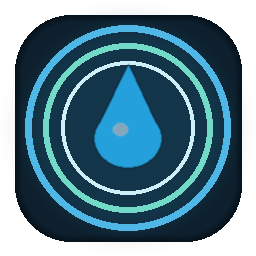

# Aqua Focus

<p align="center">
  
</p>

<p align="center">
  <strong>Descend into focus.</strong><br />
  A simple, modern Pomodoro workspace — clean focus, subtle motion, music, tasks, stats and extensions.
</p>

<p align="center">
  <a href="README.ja.md">日本語</a>
  ·
  <a href="https://github.com/kokonachan-193/Pomodoro-timer/releases/tag/v2.1.8"><strong>Aqua Focus v2.1.8</strong></a>
  ·
  Windows · macOS · Ubuntu · Linux · Android
</p>

---

## Get the app

No build required. Download the package for your platform from [**Aqua Focus v2.1.8**](https://github.com/kokonachan-193/Pomodoro-timer/releases/tag/v2.1.8).

| Platform | Package | Run |
| :--- | :--- | :--- |
| **Windows 10 / 11** | `AquaFocusSetup-2.1.8.exe` | Installer · recommended |
| **Windows** | `AquaFocus-Windows-Portable-2.1.8.zip` | Unzip → `AquaFocus.exe` |
| **macOS** | `AquaFocus-macOS-2.1.8.zip` | Unzip → `AquaFocus.app` |
| **Ubuntu / Linux** | `AquaFocus-*-Portable-2.1.8.tar.gz` | `tar xzf … && ./AquaFocus/AquaFocus` |
| **Android 8+** | `AquaFocus-Android-2.1.7.apk` | Install the APK |

ffmpeg is **bundled** on desktop. Existing desktop installs can check GitHub Releases through **AGIU**.

Android release signing notes: [`docs/android-signing.md`](docs/android-signing.md)

---

## What’s new in 2.1.8

- **Desktop animation extensions now apply live** — installing or removing animation extensions in Extensions is reflected in the Focus canvas without restarting Focus.
- **Extension state is reloaded while Focus is running** — `extensions.json` changes are detected during drawing, so installed/removed animation state no longer feels ignored.
- **Removed animations stay removed** — built-in animation defaults are added only on first run and are no longer resurrected after the user removes them.
- **GUI display stability fixes** — stale Tk/CTk widget calls after resize, theme rebuilds and Focus stop are guarded to reduce random display glitches.
- **Responsive Focus clock fix** — the v3 Focus timer no longer snaps back to an oversized fixed font every tick.
- **Source and packaged builds covered** — `sitecustomize.py` loads the runtime fixes for `python main.py`, and the PyInstaller runtime hook loads them in desktop packages.
- **Build/release updated** — desktop GitHub Actions now publish v2.1.8 artifacts and include the runtime fix modules.

### Carried forward from 2.1.7 Android

- Android Japanese-capable font bundling and safer UI fallback.
- Android responsive Focus layout and keyboard-focus stability.
- Android wave geometry stabilization, Sakura petals and APK signing workflow.

---

## Features

| Area | Included |
| :--- | :--- |
| **Focus** | Pomodoro, 25/5 · 50/10 · 90/20, long breaks, session intention |
| **Modes** | Focus · Deep Dive · Countdown · Stopwatch · Alarm |
| **Music** | YouTube / Spotify-matched / direct streams, playlists, audio output selection |
| **Soundscape** | Ocean · Rain · Brown Noise as a separate ambient layer |
| **Tasks** | Persistent tasks, completion state, focus-minute attribution |
| **Stats** | Daily / weekly / total focus time, recent sessions, 7-day chart |
| **Extensions** | Online catalog + local installed-extension registry |
| **Focus lock** | Temptation guard on desktop |
| **Accessibility** | Reduce Motion and calm-focus behavior |
| **Updates** | AGIU desktop update checker |

Product / UI plan: [`docs/aqua-focus-v2-concept.md`](docs/aqua-focus-v2-concept.md)

---

## Run from source

```bash
pip install -r requirements.txt
python main.py
```

### Build packages

```powershell
# Windows
.\scripts\make_release_win.ps1
```

```bash
# macOS / Linux
./scripts/make_release_unix.sh
```

Android:

```bash
cd android
buildozer android debug
```

---

<p align="center">
  <sub>Aqua Focus · Kokona · Modern Pomodoro focus workspace</sub>
</p>
